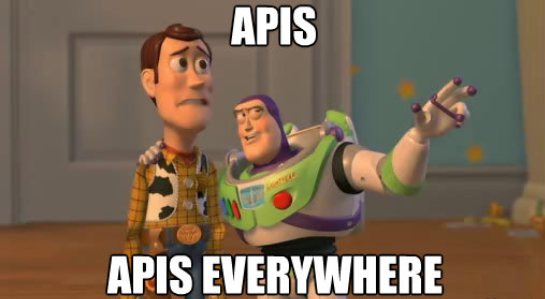

# Mini-proyect-API-de-chat by Adrian Madrid

## DESCRIPCION 

**EN ESTE PROYECTO, HE CREADO UNA API DE CONVERSACIONES DE CHATS DONDE SE PODRÁ CREAR USUARIOS, GRUPOS DE CHATS Y AÑADIR MENSAJES 
POR USUARIO. TAMBIÉN SE PODRÁN RECOGER LOS DATOS DE CADA USUARIO, CHATS Y MENSAJES, Y POR SUPUESTO EL ID DE CADA UNO DE ELLOS.
COMO GUINDA FINAL, MEDIANTE LA LIBRERÍA NLTK HE ANALIZADO LAS CONVERSACIONES DE CADA CHAT Y SACAR UN SENTIMIENTO GENERAL DE COMO SE SIENTE EL GRUPO, Y DE COMO SE SIENTE CADA UNO DE SUS INTEGRANTES!!!!**

BASICAMENTE CON LA LIBRERIA FLASK, HE CREADO UNA APP Y DESDE LA MISMA LIBRERIA, HE IMPORTADO PYMOGO PARA CONECTARLA A UNA BASE DE
DATOS CREADA POR MI Y PODER METER TODOS LOS DATOS QUE NECESITO MEDIANTE LA API QUE HE CREADO.

### EDPOINTS

#### USERS 

**/** --> SIMPLEMENTE ME DA LA BIENVENIDA CON UN ¡HOLA MUNDO!, ES LA RUTA ORIGINAL
**/create_user** --> CREO EL USUARIO, Y PARA ELLO, HAY QUE METERLE UNA SERIE DE CAMPOS OPARAMETROS:
**USERNAME**,**PASSWORD**,**EMAIL**,
LA CONTRASEÑA IRÁ CIFRADA DESPUES DE INGRESARLA PARA QUE NO SE PUEDA VER Y PARA ELLO UTILICÉ LA LIBRERÍA HASHLIB. 
¡SI NO SE METEN TODOS LOS DATOS NO SE PODRA CREAR EL USUARIO! FINALMENTE, SE AÑADIRÁ A LA BASE DE DATOS DE MONGO.
**/alls_users** ---> TE DARA TODOS LOS USUARIOS CREADOS QUE HAY EN LA BASE DE DATOS
**/user_id/?USERNAME** --> CON LA RUTA MOSTRADA Y EL PARAMETRO DEL NOMBRE DEL USUARIO TE SACARA EL ID
**/user_data/?id** --> CON LA RUTA INDICADA Y EL ID DEL USUARIO, PODRA MOSTRARTE LA API TODOS LOS DATOS DEL USER

####  GROUPS

**/create_group** ---> TE PERMITIRA CREAR UN GRUPO CON EL METODO POST, HABRA QUE INTRODUCIR UNOS CAMPOS OBLIGATORIOS COMO:
**NAME**,
**ASUNTO** Y **MEMBERS** DONDE EN ESTE ULTIMO PODRAS INCLUIR EL ID DE TODOS LOS USUARIOS QUE QUIERAS QUE ESTEN EL EN CHAT. 
FINALMENTE
SE AÑADIRÁ A LA BASE DE DATOS DE MONGO.
**/group_id/?NAME** ---> CON LA RUTA MOSTRADA Y COMO PARAMETRO EL NOMBRE DEL GRUPO LE SACARA EL ID DEL CHAT
**/all_groups** --> SACA TODOS LOS GRUPOS CON SUS DATOS
**/group_data/?id** ----> CON EL ID PROPORCIONADO POR LA API, YA PUEDES VER CADA UNO DE LOS DATOS DE CADA CHAT

#### MESSAGES

**/create_messages** ---> CON EL METODO POST CREARA LOS MENSAJES CON ESTOS CAMPOS OBLIGATORIOS: **USER**,**CHAT**,**MESSAGE**,
DONDE EN USER Y CHAT DEBERA INTRODUCIR SU ID, Y ESTO ES IMPORTANTE: ESTA CODIFICADO DE MANERA QUE NO PUEDA CREAR UN MENSAJE CON UN USUARIO QUE NO ESTE EN EL CHAT, LE DARA UNA RESPUESTA BASTANTE BORDE :P, POSTERIORMENTE SE INSERTARA EN LA BASE DE DATOS MONGO.
**/conversacion/?chat_id** --> INTRODUCIENDO EL ID DEL CHAT, TE PASARA POR RESPUESTA LA CONVERSACION CON TODOS LOS MENSAJES QUE CONTIENE
**/mensajes_user/?user_id/?id_chat** --> INTRODUCUENDO EL ID DEL CHAT, Y EL DEL USUARIO, LE MOSTRARA TODOS LOS MENSAJES DEL 
USUARIO EN ESE CHAT CONCRETO QUE HA PEDIDO EL CLIENTE

#### SENTIMIENTOS

**/chat/sentimiento/?id_chat** ----> INTRODUCIENDO ESTA RUTA CON UN ID DE CHAT COMO PARAMETRO, LE PROPORCIONARA UN ANALISIS GENERAL
DE COMO SE SIENTE EL GRUPO POR ESA CONVERSACION
**/user/sentimiento/?id_chat/?id_user** ---> APARTE DE LA RUTA, SE TENDRA QUE ESPECIFICAR EL ID DEL CHAT Y DEL USUARIO QUE QUIERAS
SOLICITAR PARA QUE TE DEVUELVA EL SENTIMIENTO GENERAL DEL USUARIO EN ESA CONVERSACION EN CONCRETO

#### PROGRAMACION DEFENSIVA

POR ULTIMO, PARA CADA ERROR QUE ME HA SALIDO AL HACER PETICIONES O PUBLICACIONES EN POSTMAN HE IDO CUBRIENDO LOS ERRORES
#CON MENSAJES MIOS PARA SABER LO QUE SON Y QUE ME SEA MAS FACIL CONTROLARLOS. ESTÁN EN LA PARTE DE ABAJO DEL CODIGO.

